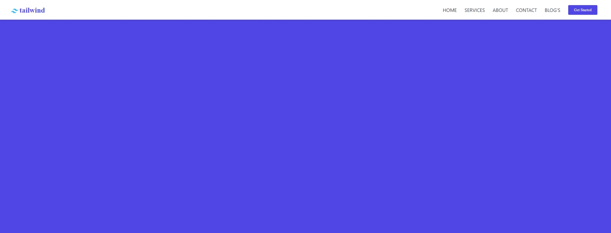

<h1 align="center"> Responsive Navbar </h1>

Projeto tirado do youtube.

  <a href="#-tecnologias">Tecnologias</a>&nbsp;&nbsp;&nbsp;|&nbsp;&nbsp;&nbsp;
  <a href="#-projeto">Projeto</a>&nbsp;&nbsp;&nbsp;|&nbsp;&nbsp;&nbsp;
  <a href="#-layout">Layout</a>&nbsp;&nbsp;&nbsp;|&nbsp;&nbsp;&nbsp;
  <a href="#-licença">Licença</a>

  

 

  

## 🚀 Tecnologias

Esse projeto foi desenvolvido com as seguintes tecnologias:

- Reactjs
- [TailwindCSS](https://tailwindcss.com/)
- [Vite](https://vitejs.dev/)
- [ionicons](https://ionic.io/ionicons)

## 💻 Projeto

Esse Navbar responsivo é um componente feito em react com um estilo em tailwind. Foi feito da forma mais simples possível, mas garantindo todas as funcionalidades pretendidas.

## 🔖 Layout

Você pode visualizar o projeto através [DESSE LINK](https://www.youtube.com/watch?v=74ys-dT94mA). É necessário ter conta no [Youtube](https://youtube.com) para acessá-lo.

## 📝 Licença

Esse projeto está sob a licença MIT.

---

Feito com ❤️ by Marcelo Claro
